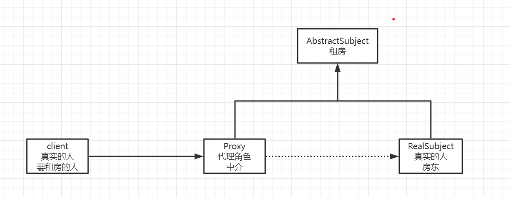
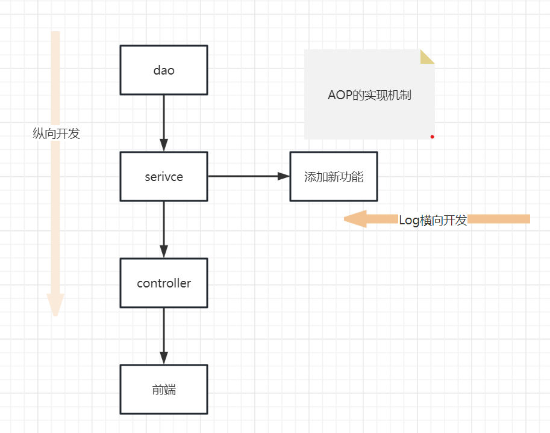
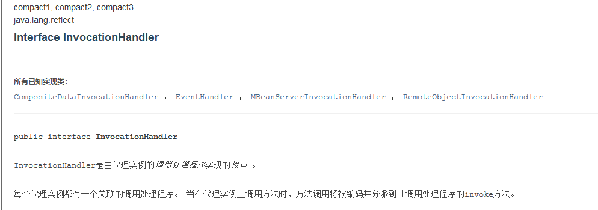
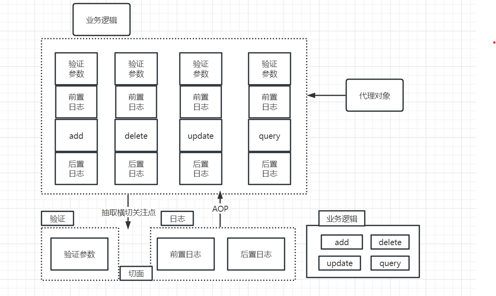
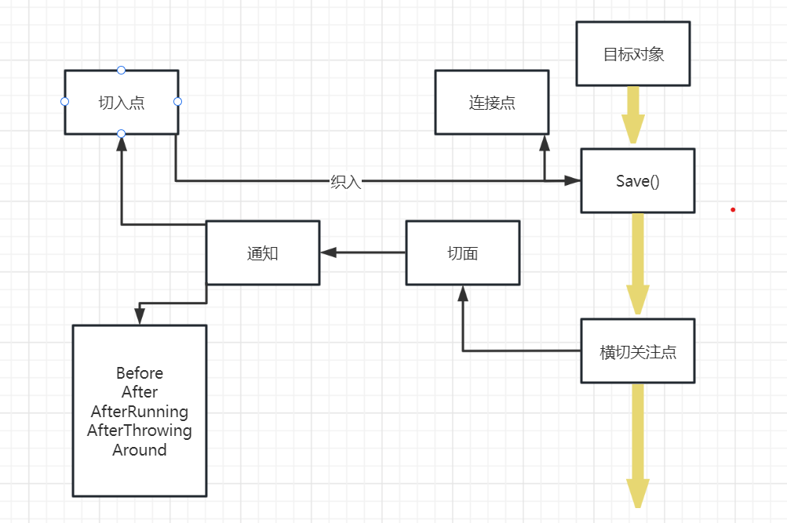

# MySpring
# spring
* Spring是一个开源的免费的框架（容器）！
* Spring是一个轻量级的，非入侵式的框架！
* 控制反转（IOC），面向切面编程（AOP）!
* 支持事务的处理，对框架整合的支持！

总结一句话：Spring就是一个轻量级的控制反转（IOC）和面向切面编程（AOP）的框架！

# IOC理论
1.UserDao接口
```java
public interface UserDao {
    void getUser();
}
```
2.UserDaoImpl实现类
```java
public class UserDaoImpl implements UserDao {
    @Override
    public void getUser() {
        System.out.println("默认获取用户的数据！");
    }
}
```
3.UserService接口
```java
public interface UserService {
    void getUser();
}
```
4.UserServiceImpl实现类
```java
public class UserServiceImpl implements UserService{
    private UserDao userDao = new UserDaoImpl();
    @Override
    public void getUser() {
        userDao.getUser();
    }
}
```
5.MyTest
```java
public class MyTest {
    public static void main(String[] args) {
        // 用户实现调用的是业务层，dao层它们不需要接触
        UserServiceImpl userService = new UserServiceImpl();
        userService.getUser();
    }
}
```
这是一个简单的业务的过程，但是现在要添加一个新的UserMysqlImpl实现类
```java
public class UserMysqlImpl implements UserDao{
    @Override
    public void getUser() {
        System.out.println("mysql数据获取！");
    }
}
```
要想要实现，UserServiceImpl实现类也需要修改
```java
public class UserServiceImpl implements UserService{
    private UserDao userDao = new UserMysqlImpl();
    @Override
    public void getUser() {
        userDao.getUser();
    }
}
```

在我们之前的业务中，用户的需求可能会影响我们原来的代码，我们需要根据用户的需求去修改源代码！
如果程序代码量十分大，修改一次的成本代价十分昂贵

我们使用一个Set接口实现,已经发生了革命性的变化！
```java
public class UserServiceImpl implements UserService{
    private UserDao userDao;

    // 利用set进行动态实现值的注入
    public void setUserDao(UserDao userDao) {
        this.userDao = userDao;
    }

    @Override
    public void getUser() {
        userDao.getUser();
    }
}
```
MyTest类
```java
public class MyTest {
    public static void main(String[] args) {
        // 用户实现调用的是业务层，dao层它们不需要接触
        UserServiceImpl userService = new UserServiceImpl();
        userService.setUserDao(new UserMysqlImpl());
        userService.getUser();
    }
}
```

之前，程序是主动创建对象！控制权在程序猿手上！
使用了set注入后，程序不在具有主动性，而是变成了被动的接受对象！
主动权再用户手上。

这种思想，从本质上解决了问题，我们程序猿不用再去管理对象的创建了!
系统的耦合性大大降低，可以更加关注再业务的实现上。这是IOC的原型！

## IOC本质
控制反转IOC（Inversion of Control），是一种设计思想，DI（依赖注入）是实现IOC的一种方法，
也有人认为DI只是IOC的另一种说法。没有IOC的程序，我们使用面向对象编程，对象的创建与对象间
的依赖关系完全硬编码在程序中，对象的创建由程序自己控制，控制反转后将对象的创建转移给第三方，
个人任务所谓控制反转就是：获得依赖对象的方式反转了。

采用XML方式配置Bean的时候，Bean的定义信息和实现分离的，而采用注解的方式可以把两者合为一体，
Bean的定义信息直接以注解的形式定义在实现类中，从而达到了零配置的目的。

控制反转是一种通过描述（XML或注解）并通过第三方生产或获取特定对象的方式。在Spring中实现
控制反转的是IOC容器，其实现方式是依赖注入（Dependency Injection,DI）

## HelloSpring

做个简单的例子体验一下

创建实体类Hello
```java
public class Hello {
    private String name;

    public String getNaem() {
        return name;
    }

    public void setName(String name) {
        this.name = name;
    }

    @Override
    public String toString() {
        return "Hello{" +
                "name='" + name + '\'' +
                '}';
    }
}
```

这里用的是XML文件方式
```java
<?xml version="1.0" encoding="UTF-8" ?>
<beans xmlns="http://www.springframework.org/schema/beans"
       xmlns:xsi="http://www.w3.org/2001/XMLSchema-instance"
       xsi:schemaLocation="http://www.springframework.org/schema/beans
        http://www.springFramework.org/schema/beans/spring-beans.xsd">

<!--    bean就是Java对象，由Spring创建和管理

        类型  变量名  =  new  类型()
        Hello hello = new Hello();

        id  =  变量
        class  =  new的对象
        property  相当于给对象中的属性设置一个值！
-->
    <bean id="hello" class="com.Hello">
        <property name="name" value="Spring"/>
    </bean>

</beans>
```

在创建一个测试类
```java
public class MyTest {

    public static void main(String[] args) {
        // 获取Spring的上下文对象！
        ApplicationContext context = new ClassPathXmlApplicationContext("Beans.xml");
        // 我们的对象现在都正在Soring中的管理了，我们要使用，直接去里面取出来就可以！
        Hello hello = (Hello) context.getBean("hello");
        System.out.println(hello.toString());
    }
}
```

测试一下，最后的输出结果
```java
Hello{name='Spring'}
```

这个过程中Hello是Spring创建的，Hello对象的属性是Spring容器设置的

这个例子的过程就是控制反转：

控制：谁来控制对象的创建，创痛应用程序的对象是由程序本身控制创建的，使用Spring后，
对象是由Spring来创建的

反转：程序本身不创建对象，而变成被动的接收对象

依赖注入：就是利用set方法进行注入的。
```java
 public void setName(String name) {
        this.name = name;
 }
```

IOC是一种编程思想，由主动的编程编程被懂的接收

在MyTest测试类中
```java
ApplicationContext context = new ClassPathXmlApplicationContext("Beans.xml");
```
浅浅看一下ClassPathXmlApplicationContext的底层代码的：

```mermaid
graph BT
ClassPathXmlApplicationContext -->  AbstractXmlApplicationContext

AbstractXmlApplicationContext -->AbstractRefreshableConfigApplicationContext

AbstractRefreshableConfigApplicationContext --> AbstractRefreshableApplicationContext

AbstractRefreshableApplicationContext --> AbstractApplicationContext

AbstractApplicationContext --> ConfigurableApplicationContext

ConfigurableApplicationContext --> ApplicationContext

```
现在，我们彻底不用再程序中改动了，要实现不同的操作，只需要在xml配置文件中进行修改，
所谓IOC,一句话搞定：对象由Spring来创建，管理，装配！

# IOC创建对象的方式
> 无参构造方法来创建

User实体类
```java
public class User {
    private String name;

    public User() {
        System.out.println("user无参构造方法！");
    }

    public void setName(String name) {
        this.name = name;
    }

    public void show() {
        System.out.println("name=="+name);
    }
}
```

UserBeanXML文件
```xml
<?xml version="1.0" encoding="UTF-8" ?>
<beans xmlns="http://www.springframework.org/schema/beans"
       xmlns:xsi="http://www.w3.org/2001/XMLSchema-instance"
       xsi:schemaLocation="http://www.springframework.org/schema/beans
        http://www.springFramework.org/schema/beans/spring-beans.xsd">

    <bean id="user" class="com.User">
        <property name="name" value="Java"/>
    </bean>

</beans>
```

测试类MyDemo
```java
public class MyDemo {

    public static void main(String[] args) {
        ApplicationContext context = new ClassPathXmlApplicationContext("UserBean.xml");
        User user = (User) context.getBean("user");
        user.show();
    }
}
```

结果可以发现，在调用show方法之前，User之前已经通过无参构造初始化了！
```java
user无参构造方法！
name==Java
```

> 有参构造方法创建

实体类Student
```java
public class Student {
    public String name;

    public Student(String name) {
        this.name = name;
    }

    public void setName(String name) {
        this.name = name;
    }

    public void show() {
        System.out.println("name===="+name);
    }
}
```

xml的三种写法
```xml
<?xml version="1.0" encoding="UTF-8" ?>
<beans xmlns="http://www.springframework.org/schema/beans"
       xmlns:xsi="http://www.w3.org/2001/XMLSchema-instance"
       xsi:schemaLocation="http://www.springframework.org/schema/beans
        http://www.springFramework.org/schema/beans/spring-beans.xsd">

<!--    第一种根据index参数下标设置-->
    <bean id="student1" class="com.Student">
        <constructor-arg index="0" value="Java1"/>
    </bean>

<!--    第二种根据参数名字设置-->
    <bean id="student2" class="com.Student">
<!--        name指参数名-->
        <constructor-arg name="name" value="Java2"/>
    </bean>

<!--    第三种根据参数类型设置-->
    <bean id="student3" class="com.Student">
        <constructor-arg type="java.lang.String" value="Java3"/>
    </bean>

</beans>
```

测试MyStudent类
```java
public class MyStudent {

    public static void main(String[] args) {
        ApplicationContext context = new ClassPathXmlApplicationContext("StudentBean.xml");

        Student student = (Student) context.getBean("student1");
        student.show();
    }
}
```

总结：在配置文件加载的时候。其中管理的对象都已经初始化了！

# Spring配置

> 别名

alias设置别名，为bean设置别名，可以设置多个别名
```xml
<!--    设置别名：在获取bean的时候可以使用别名获取-->
    <alias name="student1" alias="studentdemo"/>
```

> Bean的配置

```xml
<!--    bean接收Java对象，由于Spring创建和管理-->
<!--
        id 是bean的识别符，要唯一，如果没有配置id，name接收默认标识符
        如果配置id，又配置了name，那么name是别名
        name可以设置多个别名，可以用逗号，分号，空格隔开
        如果不配置id和name，可以根据applicationContext.getBean(.class)获取对象；

        class是bean的全限定名=包名+类名
-->
    <bean id="user" name="user2,user3,user4" class="com.xcc.demo.User">
        <property name="name" value="Java"/>
    </bean>
```

> import
> 这import，一般用于团队开发使用，他可以将多个配置文件，导入合并为一个

applicationContext.xml
```xml
<imoirt resource="student.xml"/>
<imoirt resource="UserBean.xml"/>
<imoirt resource="Beans.xml"/>
```
使用的时候，直接使用总的配置就可以了。

# DI依赖注入

### 构造器注入
之前的IOC写过有参无参

### set注入
依赖注入：set注入

依赖：bean对象的创建依赖于容器

注入：bean对象种的所有属性，由容器来注入

```xml
 <bean id="school" class="com.School">
        <property name="schoolName" value="家里蹲大学"/>
    </bean>

    <bean id="person" class="com.Person">
        <!--    常量注入-->
        <property name="name" value="小明"/>
        <!--    Bean注入-->
        <property name="school" ref="school"/>
        <!--    数组注入-->
        <property name="books">
            <array>
                <value>西游记百会文</value>
                <value>悟空传</value>
                <value>西游记后传</value>
                <value>西游记</value>
            </array>
        </property>
        <!--    List注入-->
        <property name="hobbys">
            <list>
                <value>看电影</value>
                <value>玩游戏</value>
                <value>写代码</value>
            </list>
        </property>
        <!--    Map注入-->
        <property name="card">
            <map>
                <entry key="aaa" value="111"/>
                <entry key="bbb" value="222"/>
                <entry key="ccc" value="333"/>
            </map>
        </property>
        <!--    set注入-->
        <property name="games">
            <set>
                <value>艾尔登法环</value>
                <value>最终幻想16</value>
                <value>原神</value>
                <value>LOL</value>
            </set>
        </property>
        <!--    NULL注入-->
        <property name="wife">
            <null/>
        </property>
        <!--    Properties注入-->
        <property name="info">
            <props>
                <prop key="学号">2023</prop>
                <prop key="性别">男</prop>
                <prop key="姓名">小明</prop>
            </props>
        </property>
    </bean>
```
### 其他注入
> p命名和c命名注入

```xml
<?xml version="1.0" encoding="UTF-8" ?>
<beans xmlns="http://www.springframework.org/schema/beans"
       xmlns:xsi="http://www.w3.org/2001/XMLSchema-instance"
       xmlns:p="http://www.springframework.org/schema/p"
       xmlns:c="http://www.springframework.org/schema/c"
       xsi:schemaLocation="http://www.springframework.org/schema/beans
        http://www.springFramework.org/schema/beans/spring-beans.xsd">
<!--    导入约束：xmlns:p="http://www.springframework.org/schema/p"-->
<!--    p命名空间。属性依然要设置set方法-->
    <bean id="demo" class="com.UserDemo" p:name="小白" p:age="26"/>

<!--    导入约束： xmlns:c="http://www.springframework.org/schema/c"-->
    <bean id="demo1" class="com.UserDemo" c:name="小黑" c:age="18"/>
</beans>
```
不过需要注意用c命名空间的时候，对象需要有参构造函数，p命名空间，需要无参构造函数

# bean作用域

|   Scope    | Description |
|-------|-------------|
|   singleton    |      (Default) Scopes a single bean definition to a single object instance for each Spring IoC container.       |
|   prototype    |    Scopes a single bean definition to any number of object instances.         |
|   request    |      Scopes a single bean definition to the lifecycle of a single HTTP request. That is, each HTTP request has its own instance of a bean created off the back of a single bean definition. Only valid in the context of a web-aware Spring ApplicationContext.       |
|   session    |      Scopes a single bean definition to the lifecycle of an HTTP Session. Only valid in the context of a web-aware Spring ApplicationContext.       |
|   application    |    Scopes a single bean definition to the lifecycle of a ServletContext. Only valid in the context of a web-aware Spring ApplicationContext.         |
|   websocket    |    Scopes a single bean definition to the lifecycle of a WebSocket. Only valid in the context of a web-aware Spring ApplicationContext.         |


### 1.单例模式（Spring默认机制）
只会创建一次
```xml
<bean id="demo1" class="com.UserDemo" c:name="小黑" c:age="18" scope="singleton"/>
```

### 2.原型模式
每次容器中get的时候，都会产生一个新对象！
```xml
<bean id="demo1" class="com.UserDemo" c:name="小黑" c:age="18" scope="prototype"/>
```

### 3.其余的request,session,application,websocket这些只能在web开发中使用到。

# bean的自动装配

自动装配是Spring满足bean依赖一种方式！  
Spring会在上下文中自动寻找，并自动给bean装配属性！

> 在Spring中有三种装配方式   
> 1.在xml中显示的配置   
> 2.在Java中显示配置   
> 3.隐式的自动装配bean

> byName 按名称自动装配
```xml
<?xml version="1.0" encoding="UTF-8" ?>
<beans xmlns="http://www.springframework.org/schema/beans"
       xmlns:xsi="http://www.w3.org/2001/XMLSchema-instance"
       xsi:schemaLocation="http://www.springframework.org/schema/beans
        http://www.springFramework.org/schema/beans/spring-beans.xsd">

    <bean id="dog" class="com.dog"/>
    <bean id="cat" class="com.cat"/>

    <bean id="people" class="com.People" autowire="byName">
        <property name="name" value="小黑"/>
    </bean>

</beans>
```
> byName：将查找其类中所有的set方法名，例如setCat，获得将set去掉并且字母小写的字符串，即cat
> 去Spring容器中寻找是否有此字符串名称id的对象
> 如果有，就取出注入；如果没有，就会报空指针异常。

> byType 按类型自动装配
```xml
<?xml version="1.0" encoding="UTF-8" ?>
<beans xmlns="http://www.springframework.org/schema/beans"
       xmlns:xsi="http://www.w3.org/2001/XMLSchema-instance"
       xsi:schemaLocation="http://www.springframework.org/schema/beans
        http://www.springFramework.org/schema/beans/spring-beans.xsd">

    <bean id="dog" class="com.dog"/>
    <bean id="cat" class="com.cat"/>

    <bean id="people" class="com.People" autowire="byType">
        <property name="name" value="小黑"/>
    </bean>

</beans>
```
> byTpe: 会自动在容器上下文中查找，和自己对象属性类型相同的bean！
> 使用的前提是必须保证：同一类型的对象，在Spring容器中唯一。如果不唯一，会报不唯一的异常。

# 使用注解实现自动装配

1.导入约束 context约束

2.配置注解的支持：context:annotation-config/
```xml
<?xml version="1.0" encoding="UTF-8" ?>
<beans xmlns="http://www.springframework.org/schema/beans"
       xmlns:xsi="http://www.w3.org/2001/XMLSchema-instance"
       xmlns:context="http://www.springframework.org/schema/context"
       xsi:schemaLocation="http://www.springframework.org/schema/beans
        http://www.springFramework.org/schema/beans/spring-beans.xsd
        http://www.springframework.org/schema/context
        http://www.springframework.org/context/spring-context.xsd">

<!--    -->
    <context:annotation-config/>
</beans>
```
@Autowired

直接在属性上使用即可！也可以在set方法上使用   
使用Autowired我们可以不用编写Set方法了，前提是你这自动装配的属性在IOC（Spring）容器中存在，
且符合名字byName

> @Autowired(required = false) 说明：false，对象可以为null；true，对象必须存对象，不能为null.

```java
// 如果允许对象为null，设置required = false，默认为true
@Autowired(required = false)
private Cat cat;
```

@Qualifier
> @Autowired 是根据类型自动装配的，加上@Qualifier则可以根据byName的方式自动装配
> @Qualifier不能单独使用
```xml
<bean id="dog1" class="com.dog"/>
<bean id="cat1" class="com.Cat"/>
```

```java
@Autowired
@Qualifier(value = "cat1")
private Cat cat;
@Autowired
@Qualifier(value = "dog1")
private Dog dog;
```

@Resource
> @Resource如有指定的name属性，先按该属性进行byName方式查找装配；
> 其次再进行默认的byName方式进行装配；
> 如果以上都不成功，则按byType的方式自动装配。
> 都不成功，则报异常
> 方式一
```xml
<bean id="dog" class="com.dog"/>
<bean id="cat2" class="com.Cat"/>
```
```java
// 如果允许对象为null，设置required = false，默认为true
@Resource(name = "cat2")
private Cat cat;
@Resource
private Dog dog;
```
方式二
```xml
<bean id="dog" class="com.dog"/>
<bean id="cat" class="com.Cat"/>
```
```java
@Resource
private Cat cat;
@Resource
private Dog dog;
```
### 小结
> @Autowired和@Resource异同：   
> 1、@Autowired与@Resource都可以用来装配bean。都可以写再字段上，或写再set方法上     
> 2、@Autowired默认按类型装配（属于spring规范），默认情况下必须要求依赖对象必须存在，如果
> 要允许null值，可以设置它的required属性为false，如：@Autowired(required=false),
> 如果我们想使用名称装配可以结合@Qualifiter注解进行使用   
> 3、@Resource(属于J2EE复返)，默认按照名称进行装配，名称可以通过name属性进行指定。
> 如果没有指定name属性，当注解写在字段上时，默认取字段名进行按照名称查找，如果注解写在set方法上
> 默认取属性名进行装配。当找不到名称匹配的bean时才按照类型进行装配。
> 但是需要注意的是，如果name属性一旦指定，就只会按照名称进行装配。
> 它们的作用都是用注解方式注解对象，但执行顺序不同。@Autowired先byType，@Resource先byName

# 使用注解开发

要使用注解开发，必须要保证aop包导入，使用注解需要导入context约束，添加注解的支持！
```xml
<?xml version="1.0" encoding="UTF-8" ?>
<beans xmlns="http://www.springframework.org/schema/beans"
       xmlns:xsi="http://www.w3.org/2001/XMLSchema-instance"
       xmlns:context="http://www.springframework.org/schema/context"
       xsi:schemaLocation="http://www.springframework.org/schema/beans
        http://www.springFramework.org/schema/beans/spring-beans.xsd
        http://www.springframework.org/schema/context
        http://www.springframework.org/context/spring-context.xsd">

<!--    指定要扫描的包，这个包下的注解就会生效-->
    <context:component-scan base-package="com"/>
    <context:annotation-config/>
</beans>
```
1、bean

2、 属性如何注入
```java
import org.springframework.beans.factory.annotation.Value;
// 这里这个注解的意思，就是名声这个类被Spring接管了，注册到容器中
// 等价与<bean id="user" class="com.User"/>
// @Component 组件
@Component
public class User {
    // 相当于<property name="name" value="SpringFramework"/>
    @Value("SpringFramework")
    public String name;

//    @Value("SpringFramework")
    public void setName() {
        this.name = name;
    }
}
```
3、衍生的注解    
@Component有几个衍生注解，我们在web开发中，会按照mvc三层架构分层！    
dao 【@Repository】     
service 【@Service】    
controller  【@Controller】    
这四个注解功能都是一样的，都是代表将某个注册到Spring中，装配Bean    
4、自动装配置

```java
/**
 *  @Autowired: 自动装配通过类型。名字
 *  如果Autowired不能唯一自动装配上属性，则需要通过@Qualifier(value = "xxx")
 * @Nullable 字段标记了这注解，说明这个字段可以为null；
 * @Resource： 自动装配通过名字，类型。
 */
```
5、作用域
> @Scope    
> singleton: 默认的，Spring会采用单例模式创建这个对象。关闭工厂，所有的对象都会销毁。    
> prototype：多例模式。关闭工厂，所有的对象不会销毁。内部的垃圾回收机制会回收

```java
// 单例模式
@Component
@Scope("singleton")
public class User {
    // 相当于<property name="name" value="SpringFramework"/>
    @Value("SpringFramework")
    public String name;

    public void setName() {
        this.name = name;
    }
}
```
```java
// 多例模式
@Component
@Scope("prototype")
public class User {
    // 相当于<property name="name" value="SpringFramework"/>
    @Value("SpringFramework")
    public String name;

    public void setName() {
        this.name = name;
    }
}
```
6、小结   
XML与注解：   
XML可以适用任何场景，结构清晰，维护方便     
注解不是自己提供的类使用不了，维护复杂，开发简单

XML与注解整合开发：       
XML管理Bean       
注解完成属性注入            
我们在使用的过程中，只需要注意一个问题：必须让注解生效，就需要开启注解的支持
```xml
<!--    指定要扫描的包，这个包下的注解就会生效-->
    <context:component-scan base-package="com"/>
    <context:annotation-config/>
```

# 使用Java的方式配置Spring
使用JavaConfig来装配

```java
// 这个也会被Spring托管，注册到容器中，因为它本来就是一个@Component
// @Configuration代表这是一个配置类，就和我们之前看的beans.xml
// @ComponentScan("xxxx") 意思是扫描下面路径的包
@Configuration
@ComponentScan("com")
public class AppConfig {
    // 注册一个bean，就相当于我们之前写的一个bean标签
    // 这个方法的名字，就相当于bean标签中的id属性
    // 这个方法的返回值，就相当于bean标签中的class属性
    @Bean
    public MyService myService() {
        // 就是返回哟啊注入到bean的对象！
        return new MyServiceImpl();
    }
}
```
等于
```xml
<beans>
    <bean id="myService" class="com.service.MyServiceImpl"/>
</beans>
```
Import

```java
@Configuration
@Import(AppConfig.class)
public class MyConfig {
    @Bean
    public Dog dog() {
        return new Dog();
    }
}
```
# 代理模式
SpringAOP的底层就是代理模式     
代理模式：       
1、静态代理        
2、动态代理


# 静态代理模式

### 角色分析：
* 抽象角色：一般使用接口或者抽象类来实现
* 真实角色：被代理的角色
* 代理角色：代理真实角色；代理真实角色后，一般会做一些附属的操作。
* 客户：使用代理角色来进行一些操作。

### 代码步骤：
* 1.接口
```java
// 抽象角色：租房
public interface Rent {
    public void rent();
}
```
* 2.真实角色
```java
// 真实角色：房东，房东要出租房子
public class Host implements Rent{
    public void rent() {
        System.out.println("房屋出租");
    }
}
```
* 3.代理角色
```java
// 代理角色：中介
public class Proxy implements Rent{
    private Host host;
    public Proxy() {}
    public Proxy(Host host) {
        this.host = host;
    }
    // 租房
    public void rent() {
        seeHouse();
        host.rent();
        fare();
    }
    // 看房
    public void seeHouse() {
        System.out.println("待房客看房");
    }
    // 收中介费
    public void fare() {
        System.out.println("收中介费");
    }
}
```
* 4.客户端访问代理角色
```java
// 客户类，一般客户都会找代理！
public class Client {
    public static void main(String[] args) {
        // 房东要租房
        Host host = new Host();
        // 中介帮助房东
        Proxy proxy = new Proxy(host);
        // 你去找中介
        proxy.rent();
    }
}
```

### 代理模式的好处
* 可以使真实角色的操作更加纯粹！不用去关注一些公共的业务
* 公共也就交给代理角色！实现了业务的分工！
* 公共业务发生扩展的时候，方便集中管理

### 缺点：
* 一个真实角色就会产生一个代理角色；代码量会翻倍-开发效率降低

## 补充实例
一般我们在工作中基本上都会有遇到这样的问题：      
公司有个已经写好，在用的代码：
```java
public interface UserService {
    void add();
    void delete();
    void update();
    void query();
}
```
```java
public class UserServiceImpl implements UserService {
    public void add() {
        System.out.println("添加一条信息");
    }

    public void delete() {
        System.out.println("删除一条信息");
    }

    public void update() {
        System.out.println("修改一条信息");
    }

    public void query() {
        System.out.println("查询一条信息");
    }
}
```
```java
public class test {
    public static void main(String[] args) {
        UserServiceImpl userService = new UserServiceImpl();
        userService.add();
    }
}
```
现在产品经理说要加个日志。这时候我们别随便改之前的代码，因为容易出事，但还要实现功能，所以可以用代理模式：

### 分析
* UserService: 相当于是个抽象角色，一个接口提供了增删改查4个方法
* UserServiceImpl: 相当于是个真实角色，专门实现功能的
我们现在要加个中介，中介不光实现了UserServiceImpl的所有功能，还多了个日志的功能
```java
// 代理角色，在这里添加日志的实现
public class UserServiceProxy implements UserService{
    private UserServiceImpl userService;

    public void setUserService(UserServiceImpl userService) {
        this.userService = userService;
    }
    public void add() {
        log("add");
        System.out.println("添加一条信息");
    }

    public void delete() {
        log("delete");
        System.out.println("删除一条信息");
    }

    public void update() {
        log("update");
        System.out.println("修改一条信息");
    }

    public void query() {
        log("query");
        System.out.println("查询一条信息");
    }

    public void log(String msg) {
        System.out.println("执行了"+msg+"方法");
    }
}
```
测试类
```java
public class test {
    public static void main(String[] args) {
        // 真实业务
        UserServiceImpl userService = new UserServiceImpl();
        // 代理类
        UserServiceProxy proxy = new UserServiceProxy();
        // 使用代理类实现日志功能！
        proxy.setUserService(userService);
        proxy.add();
    }
}
```
> 我们在工作中也要谨记的原则：能跑的代码不要轻易改动，你可以用代理模式加个新的中介类，但别去改之前的实现类；
> 我们在不改变原来代码的情况下，实现了对原有功能的增强，这是AOP中最核心的思想

### AOP：纵向开发，横向开发

# 动态代理模式
* 动态代理和静态代理角色一样
* 动态代理的代理类是动态生成的，不是我们直接写好的！
* 动态代理分为两大类：基于接口的动态代理，基于类的动态代理
    + 基于接口--JDK动态代理
    + 基于类：cglib
    + Java字节码实现：javassist

### InvocationHandler  和  Proxy



具体代码：
```java
public class ProxyInvocationHandler implements InvocationHandler {
    // 被代理的接口
    private Object traget;

    public void setTraget(Object traget) {
        this.traget = traget;
    }

    // 生成代理类
    public Object getProxy() {
        return Proxy.newProxyInstance(this.getClass().getClassLoader(),
                traget.getClass().getInterfaces(),this);
    }

    /**
     * 处理代理实例，并返回结果
     * proxy： 代理类
     * method：代理类的调用处理程序的方法对象
     * @param proxy the proxy instance that the method was invoked on
     *
     * @param method the {@code Method} instance corresponding to
     * the interface method invoked on the proxy instance.  The declaring
     * class of the {@code Method} object will be the interface that
     * the method was declared in, which may be a superinterface of the
     * proxy interface that the proxy class inherits the method through.
     *
     * @param args an array of objects containing the values of the
     * arguments passed in the method invocation on the proxy instance,
     * or {@code null} if interface method takes no arguments.
     * Arguments of primitive types are wrapped in instances of the
     * appropriate primitive wrapper class, such as
     * {@code java.lang.Integer} or {@code java.lang.Boolean}.
     *
     * @return
     * @throws Throwable
     */
    public Object invoke(Object proxy, Method method, Object[] args) throws Throwable {
        Log(method.getName());
        // 动态代理的本质，就是使用反射机制实现！
        Object result = method.invoke(traget, args);
        return result;
    }

    public void Log(String msg){
        System.out.println("调用了"+msg+"的方法！");
    }

}
```
测试
```java
public static void main(String[] args) {
        // 真实对象
        UserServiceImpl userService = new UserServiceImpl();
        // 代理对象的调用处理程序
        ProxyInvocationHandler p = new ProxyInvocationHandler();
        // 设置要代理的对象
        p.setTraget(userService);
        // 动态生成代理类
        UserService proxy = (UserService) p.getProxy();
        proxy.delete();
    }
```

### 动态代理的好处：
* 可以使真实角色的操作更加纯粹！不用去关注一些公共的业务
* 公共也就教给代理角色！实现了业务的分工
* 公共业务发生扩展的时候，方便集中管理！
* 一个动态代理类代理的是一个接口，一般就是对应的一类业务
* 一个动态代理类可以代理多个类，代理的是接口！

# AOP

## 什么是AOP
> AOP（Aspect Oriented Programming）意为：面向切面编程，通过预编译方式和运行期动态代理实现程序功能的统一维护
> 的一种技术。AOP是OOP的延续，是软件开发中的一个热点，也是Spring框架中的一个重要内容，是函数式编程的一种衍生泛型。
> 利用AOP可以对业务逻辑的各个部分进行隔离，从而使得业务逻辑各部分主键的耦合度降低，提高程序的可重用性，同时提高了开发效率。



## AOP在Spring中的作用

提供声明式事务；允许用户自定义切面      
* 横切关注点：跨越应用程序多个模块的方法或功能。即是，与我们业务逻辑无关的，但是我们需要关注的部分，是横切关注点。如：日志、安全、缓存、事务等等
* 切面(ASPECT)：横切关注点被模块化的特殊对象。即，它是一个类。
* 通知(Advice)：切面必须要完成的工作。即，它是类中的一个方法。
* 目标(Target)：被通知对象。
* 代理(Proxy)：向目标对象应用通知之后创建的对象。
* 切入点(PointCut)：切面通知执行的地点的定义
* 连接点(JoinPoint)：与切入带你匹配的执行点



SpringAOP中，通过Advice定义横切逻辑，Spring中支持5种类型的Advice：

| 通知类型 | 连接点  | 实现接口  |
|--|---|---|
| 前置通知 | 方法前  | org.springframework.aop.MethodBeforeAdvice  |
| 后置通知 | 方法后  | org.springframework.aop.AfterReturningAdvice  |
| 环绕通知 | 方法前后  | org.aopalliance.intercept.MethodInterceptor  |
| 异常抛出通知 | 方法抛出异常  | org.springframework.aop.ThrowsAdvice  |
| 引介通知 | 类种增加新的方法属性  | org.springframework.aop.IntroductionInterceptor  |

即AOP在不改变原有代码的情况下，去增加新的功能

## 使用Spring实现AOP
使用AOP需要导入依赖包！
```xml
<!-- https://mvnrepository.com/artifact/org.aspectj/aspectjweaver -->
<dependency>
    <groupId>org.aspectj</groupId>
    <artifactId>aspectjweaver</artifactId>
    <version>1.9.4</version>
</dependency>
```
### 第一种方式
通过SpringAPI实现       
实现编写业务接口和实现类
```java
public interface UserService {
    public void add();
    public void delete();
    public void update();
    public void search();
}
```
```java
public class UserServiceImpl implements UserService{
    @Override
    public void add() {System.out.println("增加用户");}
    @Override
    public void delete() {System.out.println("删除用户");}
    @Override
    public void update() {System.out.println("更新用户");}
    @Override
    public void search() {System.out.println("查询用户");}
}
```
然后在写增强类，一个前置增强，一个后置增强
```java
public class Log implements MethodBeforeAdvice {
 
    //method : 要执行的目标对象的方法
    //objects : 被调用的方法的参数
    //Object : 目标对象
    @Override
    public void before(Method method, Object[] objects, Object o) throws Throwable {
        System.out.println( o.getClass().getName() + "的" + method.getName() + "方法被执行了");
    }
}
```
```java
public class AfterLog implements AfterReturningAdvice {
    //returnValue 返回值
    //method被调用的方法
    //args 被调用的方法的对象的参数
    //target 被调用的目标对象
    @Override
    public void afterReturning(Object returnValue, Method method, Object[] args, Object target) throws Throwable {
        System.out.println("执行了" + target.getClass().getName()
        +"的"+method.getName()+"方法,"
        +"返回值："+returnValue);
    }
}
```
最后去Spring的文件中注册，并实现AOP切入实现，注意导入约束
```xml
<?xml version="1.0" encoding="UTF-8"?>
<beans xmlns="http://www.springframework.org/schema/beans"
       xmlns:xsi="http://www.w3.org/2001/XMLSchema-instance"
       xmlns:aop="http://www.springframework.org/schema/aop"
       xsi:schemaLocation="http://www.springframework.org/schema/beans
        http://www.springframework.org/schema/beans/spring-beans.xsd
        http://www.springframework.org/schema/aop
        http://www.springframework.org/schema/aop/spring-aop.xsd">
 
    <!--注册bean-->
    <bean id="userService" class="com.UserServiceImpl"/>
    <bean id="log" class="com.Log"/>
    <bean id="afterLog" class="com.AfterLog"/>
    <!--aop的配置-->
    <aop:config>
        <!--切入点  expression:表达式匹配要执行的方法-->
        <aop:pointcut id="pointcut" expression="execution(* com.UserServiceImpl.*(..))"/>
        <!--执行环绕; advice-ref执行方法 . pointcut-ref切入点-->
        <aop:advisor advice-ref="log" pointcut-ref="pointcut"/>
        <aop:advisor advice-ref="afterLog" pointcut-ref="pointcut"/>
    </aop:config>
</beans>
```
测试
```java
public class MyTest {
    @Test
    public void test(){
        ApplicationContext context = new ClassPathXmlApplicationContext("beans.xml");
        UserService userService = (UserService) context.getBean("userService");
        userService.search();
    }
}
```
> Spring的Aop就是将公共的业务 (日志 , 安全等) 和领域业务结合起来 , 当执行领域业务时 , 将会把公共业务加进来 . 
> 实现公共业务的重复利用 . 领域业务更纯粹 , 程序猿专注领域业务 , 其本质还是动态代理 

### 第二种方式
自定义类来实现AOP      
第一步：写个切入类
```java
public class DiyPointcut {
 
    public void before(){
        System.out.println("---------方法执行前---------");
    }
    public void after(){
        System.out.println("---------方法执行后---------");
    }
    
}
```
去spring中配置
```java
<!--第二种方式自定义实现-->
<!--注册bean-->
<bean id="diy" class="com.config.DiyPointcut"/>
<!--aop的配置-->
<aop:config>
    <!--第二种方式：使用AOP的标签实现-->
    <aop:aspect ref="diy">
        <aop:pointcut id="diyPonitcut" expression="execution(* com.UserServiceImpl.*(..))"/>
        <aop:before pointcut-ref="diyPonitcut" method="before"/>
        <aop:after pointcut-ref="diyPonitcut" method="after"/>
    </aop:aspect>
</aop:config>
```
测试
```java
public class MyTest {
    @Test
    public void test(){
        ApplicationContext context = new ClassPathXmlApplicationContext("beans.xml");
        UserService userService = (UserService) context.getBean("userService");
        userService.add();
    }
}
```

### 第三种方式
使用注解实现      
第一步：编写一个注解实现的增强类
```java
@Aspect
public class AnnotationPointcut {
    @Before("execution(* com.UserServiceImpl.*(..))")
    public void before(){
        System.out.println("---------方法执行前---------");
    }
 
    @After("execution(* com.UserServiceImpl.*(..))")
    public void after(){
        System.out.println("---------方法执行后---------");
    }
 
    @Around("execution(* com.UserServiceImpl.*(..))")
    public void around(ProceedingJoinPoint jp) throws Throwable {
        System.out.println("环绕前");
        System.out.println("签名:"+jp.getSignature());
        //执行目标方法proceed
        Object proceed = jp.proceed();
        System.out.println("环绕后");
        System.out.println(proceed);
    }
}
```
第二步：在Spring配置文件中，注册bean，并增加支持注解的配置
```xml
<!--第三种方式:注解实现-->
<bean id="annotationPointcut" class="com.AnnotationPointcut"/>
<aop:aspectj-autoproxy/>
```
aop:aspectj-autoproxy: 说明
```xml
通过aop命名空间的<aop:aspectj-autoproxy />声明自动为spring容器中那些配置@aspectJ切面的bean创建代理，织入切面。当然，spring 在内部依旧采用AnnotationAwareAspectJAutoProxyCreator进行自动代理的创建工作，但具体实现的细节已经被<aop:aspectj-autoproxy />隐藏起来了
 
<aop:aspectj-autoproxy />有一个proxy-target-class属性，默认为false，表示使用jdk动态代理织入增强，当配为<aop:aspectj-autoproxy  poxy-target-class="true"/>时，表示使用CGLib动态代理技术织入增强。不过即使proxy-target-class设置为false，如果目标类没有声明接口，则spring将自动使用CGLib动态代理。
```

# 整合Mybatis

### 1、导入jar包
junit
```xml
<dependency>
    <groupId>junit</groupId>
    <artifactId>junit</artifactId>
    <version>4.12</version>
</dependency>
```
mybatis
```xml
<dependency>
    <groupId>org.mybatis</groupId>
    <artifactId>mybatis</artifactId>
    <version>3.5.2</version>
</dependency>
```
mysql-connector-java
```xml
<dependency>
    <groupId>mysql</groupId>
    <artifactId>mysql-connector-java</artifactId>
    <version>5.7.3</version>
</dependency>
```
spring相关
```xml
<dependency>
    <groupId>org.springframework</groupId>
    <artifactId>spring-webmvc</artifactId>
    <version>5.1.10.RELEASE</version>
</dependency>
<dependency>
    <groupId>org.springframework</groupId>
    <artifactId>spring-jdbc</artifactId>
    <version>5.1.10.RELEASE</version>
</dependency>
```
aspectJAOP织入器
```xml
<!-- https://mvnrepository.com/artifact/org.aspectj/aspectjweaver -->
<dependency>
    <groupId>org.aspectj</groupId>
    <artifactId>aspectjweaver</artifactId>
    <version>1.9.4</version>
</dependency>
```
mybatis-spring整合包
```xml
<dependency>
    <groupId>org.mybatis</groupId>
    <artifactId>mybatis-spring</artifactId>
    <version>2.0.2</version>
</dependency>
```
配置Maven静态资源过滤问题！
```xml
<build>
    <resources>
        <resource>
            <directory>src/main/java</directory>
            <includes>
                <include>**/*.properties</include>
                <include>**/*.xml</include>
            </includes>
            <filtering>true</filtering>
        </resource>
    </resources>
</build>
```
### 2、编写配置文件
编写实体类
```java
public class User {
    private int id;  //id
    private String name;   //姓名
    private String pwd;   //密码
}
```
实现mybatis的配置文件
```java
<?xml version="1.0" encoding="UTF-8" ?>
<!DOCTYPE configuration
        PUBLIC "-//mybatis.org//DTD Config 3.0//EN"
        "http://mybatis.org/dtd/mybatis-3-config.dtd">
<configuration>
 
    <typeAliases>
        <package name="com"/>
    </typeAliases>
 
    <environments default="development">
        <environment id="development">
            <transactionManager type="JDBC"/>
            <dataSource type="POOLED">
                <property name="driver" value="com.mysql.jdbc.Driver"/>
                <property name="url" value="jdbc:mysql://localhost:3306/demo?useSSL=true&amp;useUnicode=true&amp;characterEncoding=utf8"/>
                <property name="username" value="root"/>
                <property name="password" value="root"/>
            </dataSource>
        </environment>
    </environments>
 
    <mappers>
        <package name="com.kuang.dao"/>
    </mappers>
</configuration>
```
UserDao接口编写
```java
public interface UserMapper {
    public List<User> selectUser();
}
```
接口对应的Mapper映射文件
```xml
<?xml version="1.0" encoding="UTF-8" ?>
<!DOCTYPE mapper
        PUBLIC "-//mybatis.org//DTD Mapper 3.0//EN"
        "http://mybatis.org/dtd/mybatis-3-mapper.dtd">
<mapper namespace="com.UserMapper">
 
    <select id="selectUser" resultType="User">
      select * from user
    </select>
 
</mapper>
```

### 3、测试

```java
@Test
public void selectUser() throws IOException {
 
    String resource = "mybatis-config.xml";
    InputStream inputStream = Resources.getResourceAsStream(resource);
    SqlSessionFactory sqlSessionFactory = new SqlSessionFactoryBuilder().build(inputStream);
    SqlSession sqlSession = sqlSessionFactory.openSession();
 
    UserMapper mapper = sqlSession.getMapper(UserMapper.class);
 
    List<User> userList = mapper.selectUser();
    for (User user: userList){
        System.out.println(user);
    }
 
    sqlSession.close();
}
```
> MyBatis-Spring
MyBatis-Spring 会帮助你将 MyBatis 代码无缝地整合到 Spring 中。

如果使用 Maven 作为构建工具，仅需要在 pom.xml 中加入以下代码即可：
```xml
<dependency>
    <groupId>org.mybatis</groupId>
    <artifactId>mybatis-spring</artifactId>
    <version>2.0.2</version>
</dependency>
```
要和 Spring 一起使用 MyBatis，需要在 Spring 应用上下文中定义至少两样东西：一个 SqlSessionFactory 和至少一个数据映射器类。

在 MyBatis-Spring 中，可使用SqlSessionFactoryBean来创建 SqlSessionFactory。要配置这个工厂 bean，只需要把下面代码放在 Spring 的 XML 配置文件中：
```xml
<bean id="sqlSessionFactory" class="org.mybatis.spring.SqlSessionFactoryBean">
  <property name="dataSource" ref="dataSource" />
</bean>
```
注意：SqlSessionFactory需要一个 DataSource（数据源）。这可以是任意的 DataSource，只需要和配置其它 Spring 数据库连接一样配置它就可以了。

在基础的 MyBatis 用法中，是通过 SqlSessionFactoryBuilder 来创建 SqlSessionFactory 的。而在 MyBatis-Spring 中，则使用 SqlSessionFactoryBean 来创建。

在 MyBatis 中，你可以使用 SqlSessionFactory 来创建 SqlSession。一旦你获得一个 session 之后，你可以使用它来执行映射了的语句，提交或回滚连接，最后，当不再需要它的时候，你可以关闭 session。

SqlSessionFactory有一个唯一的必要属性：用于 JDBC 的 DataSource。这可以是任意的 DataSource 对象，它的配置方法和其它 Spring 数据库连接是一样的。

一个常用的属性是 configLocation，它用来指定 MyBatis 的 XML 配置文件路径。它在需要修改 MyBatis 的基础配置非常有用。通常，基础配置指的是 < settings> 或 < typeAliases>元素。

需要注意的是，这个配置文件并不需要是一个完整的 MyBatis 配置。确切地说，任何环境配置（<environments>），数据源（<DataSource>）和 MyBatis 的事务管理器（<transactionManager>）都会被忽略。SqlSessionFactoryBean 会创建它自有的 MyBatis 环境配置（Environment），并按要求设置自定义环境的值。

SqlSessionTemplate 是 MyBatis-Spring 的核心。作为 SqlSession 的一个实现，这意味着可以使用它无缝代替你代码中已经在使用的 SqlSession。

模板可以参与到 Spring 的事务管理中，并且由于其是线程安全的，可以供多个映射器类使用，你应该总是用 SqlSessionTemplate 来替换 MyBatis 默认的 DefaultSqlSession 实现。在同一应用程序中的不同类之间混杂使用可能会引起数据一致性的问题。

可以使用 SqlSessionFactory 作为构造方法的参数来创建 SqlSessionTemplate 对象。
```xml
<bean id="sqlSession" class="org.mybatis.spring.SqlSessionTemplate">
  <constructor-arg index="0" ref="sqlSessionFactory" />
</bean>
```
现在，这个 bean 就可以直接注入到你的 DAO bean 中了。你需要在你的 bean 中添加一个 SqlSession 属性，就像下面这样：
```xml
public class UserDaoImpl implements UserDao {
 
  private SqlSession sqlSession;
 
  public void setSqlSession(SqlSession sqlSession) {
    this.sqlSession = sqlSession;
  }
 
  public User getUser(String userId) {
    return sqlSession.getMapper...;
  }
}
```
按下面这样，注入 SqlSessionTemplate：
```xml
<bean id="userDao" class="org.mybatis.spring.sample.dao.UserDaoImpl">
  <property name="sqlSession" ref="sqlSession" />
</bean>
```
> 整合实现一

1、引入Spring配置文件beans.xml
```xml
<?xml version="1.0" encoding="UTF-8"?>
<beans xmlns="http://www.springframework.org/schema/beans"
       xmlns:xsi="http://www.w3.org/2001/XMLSchema-instance"
       xsi:schemaLocation="http://www.springframework.org/schema/beans
        http://www.springframework.org/schema/beans/spring-beans.xsd">
```
2、配置数据源替换mybaits的数据源
```xml
<!--配置数据源：数据源有非常多，可以使用第三方的，也可使使用Spring的-->
<bean id="dataSource" class="org.springframework.jdbc.datasource.DriverManagerDataSource">
    <property name="driverClassName" value="com.mysql.jdbc.Driver"/>
    <property name="url" value="jdbc:mysql://localhost:3306/demo?useSSL=true&amp;useUnicode=true&amp;characterEncoding=utf8"/>
    <property name="username" value="root"/>
    <property name="password" value="root"/>
</bean>
```
3、配置SqlSessionFactory，关联MyBatis
```xml
<!--配置SqlSessionFactory-->
<bean id="sqlSessionFactory" class="org.mybatis.spring.SqlSessionFactoryBean">
    <property name="dataSource" ref="dataSource"/>
    <!--关联Mybatis-->
    <property name="configLocation" value="classpath:mybatis-config.xml"/>
    <property name="mapperLocations" value="classpath:com/*.xml"/>
</bean>
```
4、注册sqlSessionTemplate，关联sqlSessionFactory；
```xml
<!--注册sqlSessionTemplate , 关联sqlSessionFactory-->
<bean id="sqlSession" class="org.mybatis.spring.SqlSessionTemplate">
    <!--利用构造器注入-->
    <constructor-arg index="0" ref="sqlSessionFactory"/>
</bean>
```
5、增加Dao接口的实现类；私有化sqlSessionTemplate
```xml
public class UserDaoImpl implements UserMapper {
 
    //sqlSession不用我们自己创建了，Spring来管理
    private SqlSessionTemplate sqlSession;
 
    public void setSqlSession(SqlSessionTemplate sqlSession) {
        this.sqlSession = sqlSession;
    }
 
    public List<User> selectUser() {
        UserMapper mapper = sqlSession.getMapper(UserMapper.class);
        return mapper.selectUser();
    }
    
}
```
6、注册bean实现
```xml
<bean id="userDao" class="com.UserDaoImpl">
    <property name="sqlSession" ref="sqlSession"/>
</bean>
```
7、测试
```java
    @Test
    public void test2(){
        ApplicationContext context = new ClassPathXmlApplicationContext("beans.xml");
        UserMapper mapper = (UserMapper) context.getBean("userDao");
        List<User> user = mapper.selectUser();
        System.out.println(user);
    }
```
结果成功输出！现在我们的Mybatis配置文件的状态！发现都可以被Spring整合！
```xml
<?xml version="1.0" encoding="UTF-8" ?>
<!DOCTYPE configuration
        PUBLIC "-//mybatis.org//DTD Config 3.0//EN"
        "http://mybatis.org/dtd/mybatis-3-config.dtd">
<configuration>
    <typeAliases>
        <package name="com"/>
    </typeAliases>
</configuration>
```

> 整合实现二

dao继承Support类 , 直接利用 getSqlSession() 获得 , 然后直接注入SqlSessionFactory . 比起方式1 , 
不需要管理SqlSessionTemplate , 而且对事务的支持更加友好


### 测试
1、修改UserDaoImpl
```java
public class UserDaoImpl extends SqlSessionDaoSupport implements UserMapper {
    public List<User> selectUser() {
        UserMapper mapper = getSqlSession().getMapper(UserMapper.class);
        return mapper.selectUser();
    }
}
```
2、修改bean配置
```java
<bean id="userDao" class="com.UserDaoImpl">
    <property name="sqlSessionFactory" ref="sqlSessionFactory" />
</bean>
```
3、测试
```java
@Test
public void test2(){
    ApplicationContext context = new ClassPathXmlApplicationContext("beans.xml");
    UserMapper mapper = (UserMapper) context.getBean("userDao");
    List<User> user = mapper.selectUser();
    System.out.println(user);
}
```

# 声明式事务
## 什么是事务
> 事务就是把一系列的动作当成一个独立的工作单元，这些动作要么全部完成，要么全部不起作用。

## 事务四个属性ACID
* 原子性（atomicity）: 事务是原子性操作，由一系列动作组成，事务的原子性确保动作要么全部完成，要么完全不起作用
* 一致性（consistency）: 一旦所有事务动作完成，事务就要被提交。数据和资源处于一种满足业务规则的一致性状态中
* 隔离性（isolation）: 可能多个事务会同时处理相同的数据，因此每个事务都应该与其他事务隔离开来，防止数据损坏
* 持久性（durability）: 事务一旦完成，无论系统发生什么错误，结果都不会受到影响。通常情况下，事务的结果被写到持久化存储器中

### 测试
userDao接口新增两个方法，删除和增加用户；
```java
//添加一个用户
int addUser(User user);
 
//根据id删除用户
int deleteUser(int id);
```
mapper文件，我们故意把 deletes 写错，测试！
```xml
 <insert id="addUser" parameterType="com.User">
 insert into user (id,name,pwd) values (#{id},#{name},#{pwd})
 </insert>
 
 <delete id="deleteUser" parameterType="int">
 deletes from user where id = #{id}
</delete>
```
编写接口的实现类
```java
public class UserDaoImpl extends SqlSessionDaoSupport implements UserMapper {
 
    //增加一些操作
    public List<User> selectUser() {
        User user = new User(4,"小明","123456");
        UserMapper mapper = getSqlSession().getMapper(UserMapper.class);
        mapper.addUser(user);
        mapper.deleteUser(4);
        return mapper.selectUser();
    }
 
    //新增
    public int addUser(User user) {
        UserMapper mapper = getSqlSession().getMapper(UserMapper.class);
        return mapper.addUser(user);
    }
    //删除
    public int deleteUser(int id) {
        UserMapper mapper = getSqlSession().getMapper(UserMapper.class);
        return mapper.deleteUser(id);
    }
 
}
```
测试
```java
@Test
public void test2(){
    ApplicationContext context = new ClassPathXmlApplicationContext("beans.xml");
    UserMapper mapper = (UserMapper) context.getBean("userDao");
    List<User> user = mapper.selectUser();
    System.out.println(user);
}
```
报错：sql异常，delete写错了

结果 ：插入成功！

没有进行事务的管理；我们想让他们都成功才成功，有一个失败，就都失败，我们就应该需要事务！

以前我们都需要自己手动管理事务，十分麻烦！

但是Spring给我们提供了事务管理，我们只需要配置即可；

> Spring中的事务管理

Spring在不同的事务管理API之上定义了一个抽象层，使得开发人员不必了解底层的事务管理API就可以使用Spring的事务管理机制。

Spring支持编程式事务管理和声明式的事务管理。

### 编程式事务管理
* 将事务管理代码嵌到业务方法中来控制事务的提交和回滚
* 缺点：必须在每个事务操作业务逻辑中包含额外的事务管理代码
* 
### 声明式事务管理
* 一般情况下比编程式事务好用。
* 将事务管理代码从业务方法中分离出来，以声明的方式来实现事务管理。
* 将事务管理作为横切关注点，通过aop方法模块化。Spring中通过Spring AOP框架支持声明式事务管理。

### 使用Spring管理事务，注意头文件的约束导入 : tx
```xml
xmlns:tx="http://www.springframework.org/schema/tx"
 
http://www.springframework.org/schema/tx
http://www.springframework.org/schema/tx/spring-tx.xsd">
```

### 事务管理器
* 无论使用Spring的哪种事务管理策略（编程式或者声明式）事务管理器都是必须的。
* 就是 Spring的核心事务管理抽象，管理封装了一组独立于技术的方法。

### JDBC事务
```xml
<bean id="transactionManager" class="org.springframework.jdbc.datasource.DataSourceTransactionManager">
        <property name="dataSource" ref="dataSource" />
 </bean>
```
### 配置好事务管理器后我们需要去配置事务的通知
```xml
<!--配置事务通知-->
<tx:advice id="txAdvice" transaction-manager="transactionManager">
    <tx:attributes>
        <!--配置哪些方法使用什么样的事务,配置事务的传播特性-->
        <tx:method name="add" propagation="REQUIRED"/>
        <tx:method name="delete" propagation="REQUIRED"/>
        <tx:method name="update" propagation="REQUIRED"/>
        <tx:method name="search*" propagation="REQUIRED"/>
        <tx:method name="get" read-only="true"/>
        <tx:method name="*" propagation="REQUIRED"/>
    </tx:attributes>
</tx:advice>
```
### spring事务传播特性：
事务传播行为就是多个事务方法相互调用时，事务如何在这些方法间传播。spring支持7种事务传播行为：

* propagation_requierd：如果当前没有事务，就新建一个事务，如果已存在一个事务中，加入到这个事务中，这是最常见的选择。
* propagation_supports：支持当前事务，如果没有当前事务，就以非事务方法执行。
* propagation_mandatory：使用当前事务，如果没有当前事务，就抛出异常。
* propagation_required_new：新建事务，如果当前存在事务，把当前事务挂起。
* propagation_not_supported：以非事务方式执行操作，如果当前存在事务，就把当前事务挂起。
* propagation_never：以非事务方式执行操作，如果当前事务存在则抛出异常。
* propagation_nested：如果当前存在事务，则在嵌套事务内执行。如果当前没有事务，则执行与propagation_required类似的操作

Spring 默认的事务传播行为是 PROPAGATION_REQUIRED，它适合于绝大多数的情况。

### 配置AOP
导入aop的头文件！
```xml
<!--配置aop织入事务-->
<aop:config>
    <aop:pointcut id="txPointcut" expression="execution(* com.*.*(..))"/>
    <aop:advisor advice-ref="txAdvice" pointcut-ref="txPointcut"/>
</aop:config>
```
### 进行测试
删掉刚才插入的数据，再次测试！
```java
@Test
public void test2(){
    ApplicationContext context = new ClassPathXmlApplicationContext("beans.xml");
    UserMapper mapper = (UserMapper) context.getBean("userDao");
    List<User> user = mapper.selectUser();
    System.out.println(user);
}
```

### 为什么需要配置事务？
* 如果不配置事务，可能存在数据提交不一致的情况；
* 如果我们不在Spring中去配置声明式事务，我们就需要在代码中手动配置事务
* 事务在项目开发过程非常重要，涉及到数据的一致性和完整性问题，不容马虎！